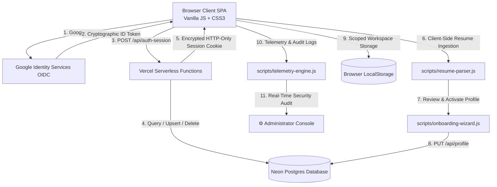

# 🚀 Career Engine — Personal AI Career & Skill Intelligence Platform

[](https://github.com/CipherPole/career-engine/actions/workflows/ci.yml)
[](https://github.com/CipherPole/career-engine/actions/workflows/security-audit.yml)
[](https://career-engine-five.vercel.app)
[](https://neon.tech)
[](#technology-stack)
[](docs/ROADMAP.md)

> **Platform:** Career Engine — Universal AI Career & Skill Intelligence Platform  
> **Repository:** `CipherPole/career-engine`  
> **Production URL:** [career-engine-five.vercel.app](https://career-engine-five.vercel.app)  
> **Admin & Platform Owner:** Joseph Erexson III (`jerexson3@gmail.com`)  
> **Primary Target:** SRE / Platform Engineering / Cloud Architecture | 100% Remote  

---

## 🌟 What is Career Engine?

**Career Engine** is an enterprise-grade, client-first career acceleration platform. Built on pure modern web standards, it delivers instant resume ingestion, real-time ATS keyword matching, interactive skill radar charts, an application tracking CRM, and structured certification pathways.

Originally conceived as an executive career portfolio, Career Engine has evolved into a **universal multi-tenant platform**. Every candidate who visits receives their own **completely private, isolated workspace** with zero data leakage from other accounts.

---

## ✨ Key Platform Features

### 1. 🚪 Clean Two-Phase Sign-In & Onboarding
- **Phase 1 (Clean Entry Gate):** A focused, distraction-free landing page with an interactive constellation network, motion aurora gradients, and a single Google Identity button.
- **Phase 2 (Dedicated Resume Upload):** Rendered immediately after a new candidate signs in. Features a 4-step progress bar (`[✓ Google Verified] ──▶ [📄 Upload Resume] ──▶ [👁️ Review] ──▶ [🚀 Create Profile]`), large drag-and-drop dropzone, and text paste fallback.

### 2. ⚡ Client-Side Resume Parser (`scripts/resume-parser.js`)
- Instant extraction of candidate contact information, job titles, technical skills, employment chronologies, and achievements.
- Runs 100% client-side in the browser—zero external file uploads required for parsing.

### 3. 🛡️ Strict Multi-Tenant Isolation (Zero Data Leakage)
- Every candidate begins with a clean slate. New users never see or inherit personal data, work history, or compensation figures from the platform owner.
- Candidate name and verified email are populated directly from Google OIDC claims with a readonly `[✅ Google Verified]` badge.
- Scoped browser storage (`careerEngine_profile_<email>`) paired with row-level PostgreSQL session isolation.

### 4. 🗑️ 3-Second Hover-to-Confirm Account Deletion & Purge
- Physical protection against accidental deletion: candidates must hover over the confirmation button for **3 continuous seconds** while a dynamic progress bar fills.
- Complete cascading deletion across Neon Postgres database tables (`users`, `user_profiles`, `user_states`).
- Full purge of browser cache and cookies, allowing users to start fresh or re-register cleanly at any time.

### 5. 🎯 Resume Studio & Real-Time ATS Gap Analyzer
- Live ATS match score (0–100) calculated dynamically against target role requirements.
- Real-time missing keyword highlights, skill radar charts, and instant ATS-compliant PDF generation.

### 6. 📊 Job Application CRM Pipeline
- Interactive 5-stage tracking pipeline: Wishlist, Applied, Interviewing, Offer, Rejected.
- Scoped cloud synchronization via `/api/state?key=jobs`.

### 7. 🛰️ Admin Console, Telemetry & Server Action Logs
- 150-event circular ring-buffer telemetry engine (`scripts/telemetry-engine.js`).
- Live-updating Admin Action Log with color-coded event badges (Red for `USER_DELETED`, Purple for `USER_CREATED`, Blue for `USER_SIGNIN`).
- 1-click clipboard diagnostic export for rapid issue triaging.

---

## 🏛️ System Architecture & Technology Stack



- **Frontend:** Pure Vanilla JavaScript (ES2022+ Modules) + Vanilla CSS3 (Custom Design System). Zero build step, zero npm runtime dependencies.
- **Backend / Edge:** Node.js Serverless Functions deployed on the Vercel Edge Network (`/api/*.js`).
- **Database:** Neon Serverless PostgreSQL (`users`, `user_profiles`, `user_states`, `auth_events`) with connection pooling and cascading foreign keys.
- **Authentication:** Google Identity Services (GIS) OIDC JWT + Encrypted HMAC-SHA256 HTTP-only session cookies.

---

## 📁 Repository Directory Structure

```
e:\resume/
├── index.html                  # Single-Page Application HTML shell & entry point
├── package.json                # Project manifest, npm test, and npm audit scripts
├── vercel.json                 # Serverless routing, headers, rewrites, and security config
├── launch.bat                  # Local quick-launch helper
├── audit.bat                   # Local security audit execution script
├── AGENTS.md                   # Strict Agent Operating Guide and CI/CD workflow rules
│
├── api/                        # Vercel Serverless Functions (Node.js runtime)
│   ├── auth-config.js          # Serves GOOGLE_CLIENT_ID from environment
│   ├── auth-session.js         # Session creation (POST) and termination (DELETE)
│   ├── me.js                   # Authenticated user identity endpoint (GET)
│   ├── profile.js              # User profile CRUD & account deletion (GET/PUT/DELETE)
│   ├── state.js                # Scoped user state persistence (jobs, training, certs) (GET/PUT)
│   ├── admin-auth-events.js    # Admin-only audit log reader (GET)
│   └── _lib/                   # Shared serverless utilities
│       ├── db.js               # Neon Postgres pool, schema migration, and data queries
│       ├── session.js          # Cryptographic session cookie sealing, parsing, and clearing
│       └── http.js             # Standardized HTTP JSON responses, errors, and body parsing
│
├── scripts/                    # Frontend ES Modules (Vanilla JS)
│   ├── app.js                  # Master application router, navigation, and page dispatcher
│   ├── auth-engine.js          # Identity state, Google OIDC token handler, profile modal, delete flow, admin settings
│   ├── signin-engine.js        # Two-phase sign-in gateway (Phase 1: Google button; Phase 2: Resume upload dropzone)
│   ├── onboarding-wizard.js    # 4-step resume review modal, safe profile synthesis, and account creation
│   ├── resume-parser.js        # Client-side multi-format resume text parser and keyword extractor
│   ├── resume-engine.js        # Resume Studio, ATS keyword match scoring, and skills radar
│   ├── tracker-engine.js       # Job application tracker, pipeline stages, and company notes
│   ├── training-engine.js      # Learning pathways, lab projects, and skill progress tracking
│   ├── cert-engine.js          # Certification registry, credential verification, and expiry tracking
│   ├── implementation-engine.js# Antigravity Implementation Lab (prompt evaluation & coaching)
│   ├── telemetry-engine.js     # Circular ring-buffer logger, error capture, and diagnostics export
│   ├── legal-engine.js         # Terms of Service and User Agreement renderer
│   ├── project-showcase.js     # Technical portfolio cards and GitHub repository showcases
│   ├── linkedin-engine.js      # Profile optimization copy blocks and headline generators
│   └── security-audit.js       # Pre-commit zero-secrets and dependency security scanner
│
├── styles/
│   ├── index.css               # Core CSS design tokens, typography, glassmorphism, responsive grid
│   └── main.css                # Legacy & component-specific style rules
│
├── data/
│   ├── resume.json             # Seed template for resume structure
│   ├── skills.json             # Skill catalog and market valuation benchmarks
│   ├── projects.json           # Engineering project showcase data
│   ├── jobs.json               # Seed application tracking data (gitignored private data)
│   └── training-projects.json  # Curated training lab exercises
│
├── pages/
│   ├── resume.html             # Clean, ATS-safe printable resume page
│   └── portfolio.html          # Public-facing portfolio showcase
│
└── docs/                       # Comprehensive Engineering & Architecture Documentation
    ├── PROJECT_OVERVIEW.md     # High-level architecture, user lifecycles, and isolation model
    ├── MODULE_GUIDE.md         # Deep-dive into every file, function, and interface
    ├── ARCHITECTURE.md         # Technical architecture and data flow diagrams
    ├── SESSION_CHANGELOG.md    # Chronological history of milestones, bugs, and fixes
    ├── ROADMAP.md              # RICE-scored strategic backlog and release history
    ├── UI_PROGRAMMING_STANDARDS.md # UI design tokens, aesthetics, and animation guidelines
    ├── CODE_REVIEW_SECURITY_POLICY.md # Security audit policies and zero-secret rules
    ├── ENGINEERING_WORKFLOW.md # Git, branch, and Vercel release runbook
    ├── ADMIN_GUIDE.md          # Guide for platform owner administration
    ├── IMPLEMENTATION_PLAYBOOK.md # Prompt coaching and implementation patterns
    ├── TERMS_OF_SERVICE.md     # Platform terms and intellectual property rights
    └── USER_AGREEMENT.md       # User privacy agreement and zero-data-brokering terms
```

---

## ⚡ Developer Quickstart

### 1. Launching Locally
Because Career Engine uses modern ES Modules, run with a local web server:

```powershell
# Quick launch helper:
.\launch.bat

# Or run any static server:
npx serve -l 4444 .
```
Navigate to `http://localhost:4444` in Chrome or Edge.

---

### 2. Pre-Commit Verification (Mandatory)
In accordance with [AGENTS.md](AGENTS.md), always run pre-commit checks before pushing any branch:

```powershell
# 1. Run security, policy, and syntax scan
npm test

# 2. Verify zero dependency vulnerabilities
npm audit
```

If any check fails, do not commit.

---

### 3. Environment Variables
To enable full cloud persistence in development or preview environments, configure these variables in Vercel or your local `.env`:

| Variable | Description | Scope |
| :--- | :--- | :--- |
| `GOOGLE_CLIENT_ID` | Google Identity Services OAuth 2.0 Client ID | Production & Preview |
| `SESSION_SECRET` | 32+ character secret for HMAC-SHA256 session cookie sealing | Production & Preview |
| `POSTGRES_URL` | Neon Serverless PostgreSQL connection URI | Production & Preview |

---

## 📚 Essential Documentation Links

- **[docs/PROJECT_OVERVIEW.md](docs/PROJECT_OVERVIEW.md):** System architecture, onboarding lifecycle, and multi-tenant isolation model.
- **[docs/MODULE_GUIDE.md](docs/MODULE_GUIDE.md):** Complete function-by-function guide to all scripts and API micro-endpoints.
- **[docs/ARCHITECTURE.md](docs/ARCHITECTURE.md):** Neon database ERD, sequence diagrams, and RBAC matrix.
- **[docs/SESSION_CHANGELOG.md](docs/SESSION_CHANGELOG.md):** Chronological log of development milestones, bugfixes, and architectural decisions.
- **[docs/ROADMAP.md](docs/ROADMAP.md):** RICE-scored strategic backlog and upcoming feature priorities.
- **[AGENTS.md](AGENTS.md):** Required operational rules for AI agents and human contributors.
- **[docs/UI_PROGRAMMING_STANDARDS.md](docs/UI_PROGRAMMING_STANDARDS.md):** Visual excellence, animation principles, and CSS design tokens.
- **[docs/CODE_REVIEW_SECURITY_POLICY.md](docs/CODE_REVIEW_SECURITY_POLICY.md):** Zero-credential git hygiene and security scanning rules.

---

*Engineered with precision for continuous career growth.*
