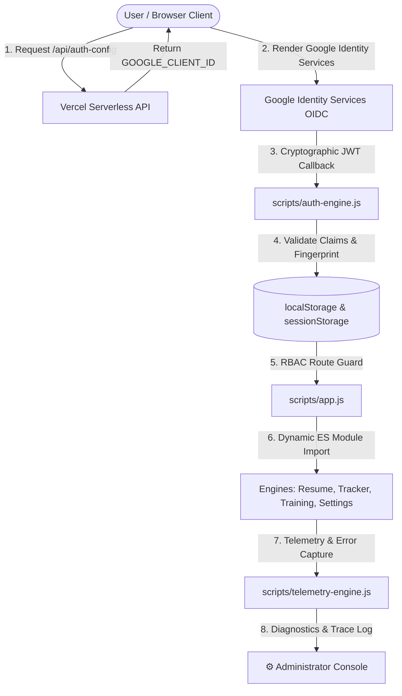

# Career Engine — System Architecture & Technical Specification

> **Platform:** Career Engine — Personal AI Career & Skill Intelligence Platform  
> **Repository:** `CipherPole/career-engine`  
> **Hosting & Edge:** Vercel Serverless (`https://career-engine-five.vercel.app`)  
> **Primary Stakeholder / Platform Admin:** Joseph Erexson III (`jerexson3@gmail.com`)  
> **Last Updated:** September 2026

---

## 1. High-Level Architectural Overview

Career Engine is an enterprise-grade, client-first Single Page Application (SPA) backed by Vercel serverless micro-endpoints. It delivers real-time ATS gap analysis, interactive skill radar charts, automated career roadmaps, and zero-trust Role-Based Access Control (RBAC).



---

## 2. Authentication & Zero-Trust Security Pipeline

### 2.1 Zero-Credential Git Hygiene (Option A Architecture)
- **Principle:** No API keys, Google Client IDs, private tokens, or secrets are ever committed to Git.
- **Pre-Flight Hook:** `node scripts/security-audit.js` runs automatically on every `git commit` via pre-commit hooks, scanning 40+ security signatures.
- **Serverless Resolution:** At runtime, the client calls `fetch('/api/auth-config')`.
  - In Production (Vercel): `api/auth-config.js` retrieves `process.env.GOOGLE_CLIENT_ID` securely from Vercel Project Environment Variables.
  - In Offline / Development: Falls back gracefully to `localStorage` admin override.

### 2.2 Google Identity Services (OIDC JWT)
- **Standard Button & Personalization:**
  - Google Identity Services dynamically renders Google's official iframe button.
  - If the user is logged into Google on desktop Chrome, Google automatically personalizes the button to `"Sign in as [Name]"`.
  - When not logged in, or on first visit, the button displays `"Create Account with Google"` or `"Continue with Google"`.
- **JWT Cryptographic Verification (`validateGoogleJwt`):**
  - Issuer validation (`accounts.google.com` or `https://accounts.google.com`).
  - Expiration timestamp validation (`exp > now`).
  - Audience validation against the resolved `GOOGLE_CLIENT_ID`.
  - Decodes claims (`email`, `name`, `picture`, `sub`, `iat`).

### 2.3 RBAC Roles & Identity
| Role | Identifier | Permissions |
| :--- | :--- | :--- |
| **`ROLE_ADMIN`** | Verified email `jerexson3@gmail.com` | Full administrative control, Client ID settings, Action Logs & Trace Route Console, security lockdown. |
| **`ROLE_USER`** | Any authenticated Google user | Isolated private workspace, persistent profile in `localStorage`, ATS gap engine, job tracker. |
| **`ROLE_GUEST`** | Unauthenticated visitors | Read-only showcase access to dashboard, radar charts, project showcases. |

### 2.4 Anti-Tamper Session Fingerprinting
Sessions are cryptographically bound to the browser environment:
$$\text{Fingerprint} = \text{Hash}(\text{sub} \mid \text{iat} \mid \text{UserAgent} \mid \text{Host})$$
If localStorage is tampered with or transferred to another device, the session is invalidated immediately (`revokeSession()`). Inactivity lock automatically revokes admin sessions after 30 minutes of idle time.

---

## 3. Telemetry & Action Logs Engine (`scripts/telemetry-engine.js`)

The platform contains an in-memory and persistent ring-buffer telemetry engine:
- **Capacity:** 150 structured log entries stored in `localStorage` (`careerEngine_telemetry_logs_v1`).
- **Levels:** `INFO`, `WARN`, `ERROR`, `SECURITY`.
- **Categories:**
  - `AUTH`: GSI initialization, button renders, popup focus, JWT validation, sign-ins, sign-outs.
  - `NETWORK`: HTTP status, latency in milliseconds, endpoint health for serverless calls.
  - `ROUTER`: Route transitions (`#signin`, `#dashboard`, `#settings`), page loads.
  - `RBAC`: Permission checks, access denied events, idle lockouts.
  - `SYSTEM`: Uncaught JavaScript exceptions (`window.onerror`), unhandled promise rejections.
- **Reporting:** `generateDiagnosticsReport()` compiles an ASCII diagnostic trace report complete with user-agent, screen viewport, active session state, client ID status, and recent chronological events.

---

## 4. User Profile & Sign-Out Lifecycle

1. **Top Bar Profile Pill (`#user-auth-pill`):**
   - Clickable interactive card showing the user's avatar, name, and role badge.
   - Includes a direct quick **`🚪 Sign Out`** button for 1-click access.
   - On mobile screens ($\le 900\text{px}$), renders a **`☰ Menu`** hamburger toggle to slide open the navigation sidebar.
2. **User Profile Modal (`openAuthModal`):**
   - Dynamically injected into `#auth-modal`.
   - Displays avatar, name, verified Google email, role badge, session fingerprint, and Google Auth status.
   - Provides quick navigation shortcuts to Dashboard, Skills Radar, and (for Admin) the Administrator Console & Action Logs.
   - Features a prominent red **`🚪 Sign Out of Workspace`** button.
3. **Sign-Out Execution (`signOut`):**
   - Logs `AUTH_SIGNOUT` in telemetry.
   - Wipes session tokens from `sessionStorage` and `localStorage`.
   - Cleans up active showcase flags.
   - Updates sidebar visibility and redirects to `#signin`.

---

## 5. Directory Structure & Key Files

```
e:\resume/
├── api/
│   └── auth-config.js          # Vercel serverless function (serves GOOGLE_CLIENT_ID)
├── docs/
│   ├── ARCHITECTURE.md         # This technical architecture manual
│   ├── SESSION_CHANGELOG.md    # Chronological history of sessions & fixes
│   ├── ADMIN_GUIDE.md          # Admin operator guide for Google OAuth & telemetry
│   ├── TERMS_OF_SERVICE.md     # Official platform terms of service & IP policy
│   ├── USER_AGREEMENT.md       # User agreement & zero-trust privacy policy
│   └── ...                     # Career intelligence & resume guides
├── scripts/
│   ├── app.js                  # Core router, state manager, navigation
│   ├── auth-engine.js          # Google OIDC JWT, session management, RBAC, Admin Console
│   ├── signin-engine.js        # Sign-in gateway, motion aurora, constellation canvas
│   ├── telemetry-engine.js     # Enterprise ring buffer, error interception, diagnostics
│   ├── legal-engine.js         # Terms of Service & User Agreement viewer
│   ├── resume-engine.js        # Dashboard, Resume Studio, Skill Gap engine
│   ├── tracker-engine.js       # Job search application tracker
│   ├── training-engine.js      # Training hub & interactive radar chart
│   ├── cert-engine.js          # Certifications & credential verification
│   ├── project-showcase.js     # Engineering projects showcase
│   └── security-audit.js       # Pre-flight paranoid security hook
├── styles/
│   └── main.css                # Design system, dark mode tokens, motion animations, modals
├── index.html                  # Core HTML shell & cache-busted module imports
└── vercel.json                 # Vercel routing rules & cache-control headers
```
