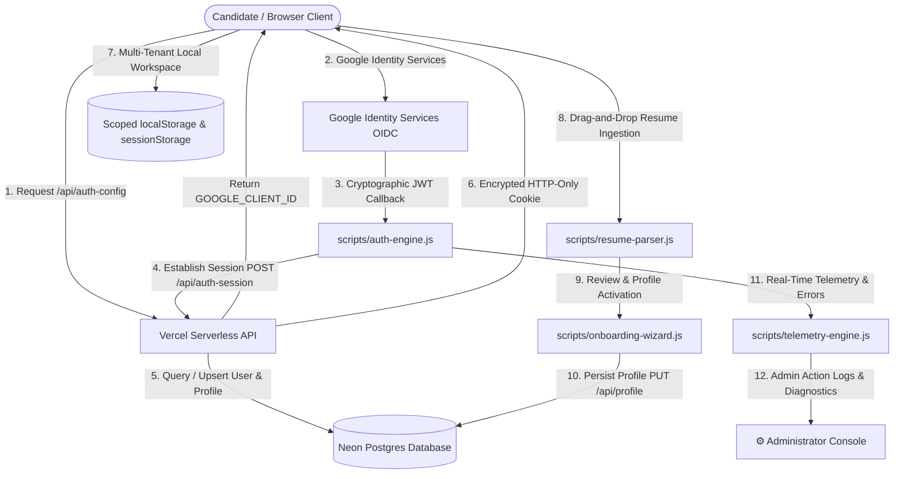
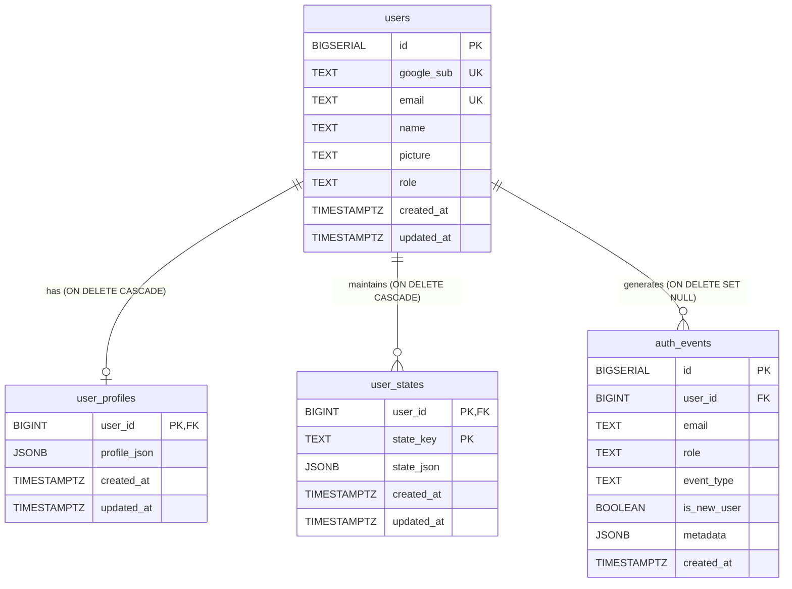
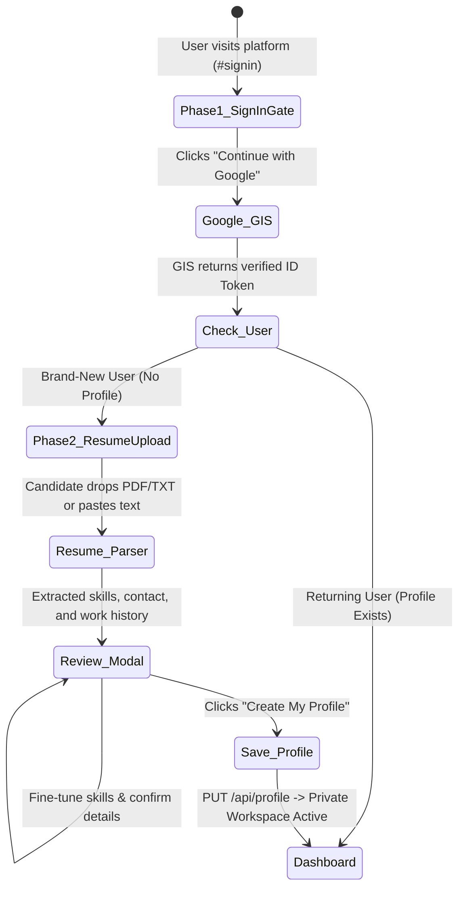
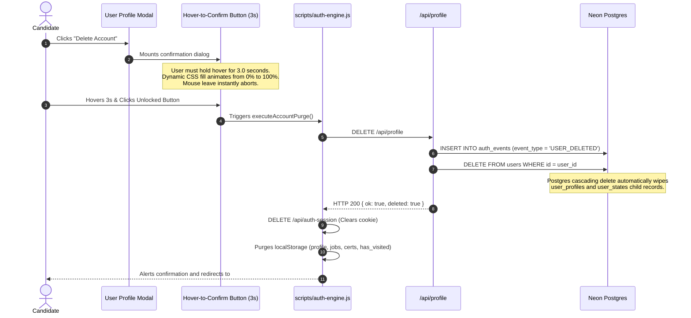

# Career Engine — System Architecture & Technical Specification

> **Platform:** Career Engine — Personal AI Career & Skill Intelligence Platform  
> **Repository:** `CipherPole/career-engine`  
> **Hosting & Edge:** Vercel Serverless Functions (`https://career-engine-five.vercel.app`)  
> **Primary Database:** Neon Postgres (`career_engine_prd` / `career_engine_dev`)  
> **Primary Stakeholder / Platform Admin:** Joseph Erexson III (`jerexson3@gmail.com`)  
> **Last Updated:** September 2026

---

## 1. High-Level Architectural Overview

Career Engine is an enterprise-grade, client-first Single Page Application (SPA) powered by pure Vanilla JavaScript, modern CSS3 design tokens, and backed by Vercel serverless micro-endpoints and Neon PostgreSQL. It delivers instant resume drag-and-drop ingestion, real-time ATS gap analysis, interactive skill radar charts, automated career roadmaps, and zero-trust Role-Based Access Control (RBAC).



---

## 2. Neon Postgres Relational Schema & State Management

The database persistence layer (`api/_lib/db.js`) is connected to Neon Postgres via `@neondatabase/serverless`. Schema migrations are fully idempotent and executed automatically via `ensureSchema()`:



### Table Specifications:
1. **`users`**: Master user identity directory indexed by unique Google Subject ID (`google_sub`) and normalized email. Role resolves to `'admin'` if email matches `jerexson3@gmail.com`, and `'user'` for all other candidates.
2. **`user_profiles`**: JSONB document store containing structured resume data (contact info, target titles, summary, skill categories, work history, education, certifications). Foreign key references `users(id)` with `ON DELETE CASCADE`.
3. **`user_states`**: Key-value JSONB table partitioned by `(user_id, state_key)` supporting synchronization of candidate tracking state (`jobs`), curriculum progress (`training`), and credentials (`certs`). References `users(id)` with `ON DELETE CASCADE`.
4. **`auth_events`**: Immutable audit log recording authentication and security actions (`USER_CREATED`, `USER_SIGNIN`, `USER_SIGNOUT`, `USER_DELETED`). References `users(id)` with `ON DELETE SET NULL` to preserve historical security audit records after user deletion.

---

## 3. Two-Phase Onboarding & Resume Ingestion Pipeline

To prevent user cognitive overload and eliminate profile data leakage from the platform owner, authentication and onboarding are strictly decoupled into two distinct phases:



### Strict Zero-Data-Leakage Guarantees:
- **Identity Binding:** Candidate name and verified email are populated directly from Google OIDC claims. Email is marked readonly with a `[✅ Google Verified]` badge.
- **Clean Slate Initialization:** Any resume section not detected during parsing (experience, education, certifications, accomplishments) defaults to an empty array (`[]`). At no point are Joseph's resume bullets or compensation figures inserted into a new candidate's workspace.
- **Privacy Notice:** Onboarding review modal prominently affirms: *"🔒 Your profile is completely private and isolated to your account."*

---

## 4. Account Deletion & Purge Architecture

To provide full user autonomy and comply with zero-trust privacy standards, users can purge their entire digital footprint at any time.



---

## 5. Role-Based Access Control (RBAC) Matrix

| Feature / Endpoint | `ROLE_ADMIN` (`jerexson3@gmail.com`) | `ROLE_USER` (Authenticated) | `ROLE_GUEST` (Unauthenticated) |
| :--- | :---: | :---: | :---: |
| **Clean Sign-In Gate (`#signin`)** | ✅ Accessible | 🔄 Redirected to Dashboard | ✅ Accessible |
| **Candidate Dashboard (`#dashboard`)** | ✅ Accessible | ✅ Private Isolated Workspace | ❌ Redirected to Sign-In |
| **Resume Studio & ATS Analysis (`#resume`)** | ✅ Accessible | ✅ Private ATS Scanner | ❌ Redirected to Sign-In |
| **Job Search CRM (`#tracker`)** | ✅ Accessible | ✅ Private Scoped Pipeline | ❌ Redirected to Sign-In |
| **Training & Certs Hub (`#training`)** | ✅ Accessible | ✅ Private Progress Radar | ❌ Redirected to Sign-In |
| **Administrator Console (`#settings`)** | ✅ Full Access | ❌ 403 Forbidden | ❌ 403 Forbidden |
| **Server Auth Events Log (`/api/admin-auth-events`)** | ✅ Full Access | ❌ 403 Forbidden | ❌ 403 Forbidden |
| **Self-Service Account Deletion** | 🛡️ Protected (Immune) | ✅ 3-Second Hover-to-Purge | ❌ Not Applicable |
| **Terms & User Agreement (`#terms`, `#agreement`)** | ✅ Accessible | ✅ Accessible | ✅ Accessible |

---

## 6. Directory Structure & Key Files

```
e:\resume/
├── index.html                  # Single-Page Application HTML shell & entry point
├── package.json                # Project manifest, npm test, and npm audit scripts
├── vercel.json                 # Serverless routing, headers, rewrites, and security config
│
├── api/                        # Vercel Serverless Micro-Endpoints
│   ├── auth-config.js          # Serves GOOGLE_CLIENT_ID from environment
│   ├── auth-session.js         # Session creation (POST) and termination (DELETE)
│   ├── me.js                   # Authenticated user identity endpoint (GET)
│   ├── profile.js              # User profile CRUD & account deletion (GET/PUT/DELETE)
│   ├── state.js                # Key-value user state persistence (jobs, training, certs)
│   ├── admin-auth-events.js    # Admin-only audit log reader (GET)
│   └── _lib/                   # Shared backend utilities
│       ├── db.js               # Neon Postgres pool, schema migration, queries, and deletion
│       ├── session.js          # Cryptographic cookie sealing, parsing, and clearing
│       └── http.js             # Standardized HTTP JSON responses and body parsing
│
├── scripts/                    # Frontend ES Modules (Vanilla JS)
│   ├── app.js                  # Master application router, navigation, and page dispatcher
│   ├── auth-engine.js          # Identity state, GIS token handler, profile modal, delete flow, admin settings
│   ├── signin-engine.js        # Two-phase sign-in gateway (Phase 1: Google button; Phase 2: Resume dropzone)
│   ├── onboarding-wizard.js    # 4-step resume review modal, safe profile synthesis, and account creation
│   ├── resume-parser.js        # Client-side multi-format resume text parser and keyword extractor
│   ├── resume-engine.js        # Resume Studio, ATS keyword match scoring, and skills radar
│   ├── tracker-engine.js       # Job application tracker, pipeline stages, and company notes
│   ├── training-engine.js      # Learning pathways, lab projects, and skill progress tracking
│   ├── cert-engine.js          # Certification registry, credential verification, and expiry tracking
│   ├── implementation-engine.js# Antigravity Implementation Lab (prompt evaluation & coaching)
│   ├── telemetry-engine.js     # Circular ring-buffer logger, error capture, and diagnostics export
│   ├── legal-engine.js         # Terms of Service and User Agreement renderer
│   ├── project-showcase.js     # Technical portfolio cards and GitHub repository showcases
│   ├── linkedin-engine.js      # Profile optimization copy blocks and headline generators
│   └── security-audit.js       # Pre-commit zero-secrets and dependency security scanner
│
├── styles/
│   ├── index.css               # Core CSS design tokens, typography, glassmorphism, responsive grid
│   └── main.css                # Legacy & component-specific style rules
│
└── docs/                       # Comprehensive Engineering & Architecture Documentation
    ├── PROJECT_OVERVIEW.md     # High-level architecture, user lifecycles, and isolation model
    ├── MODULE_GUIDE.md         # Deep-dive into every file, function, and interface
    ├── ARCHITECTURE.md         # (This file) Technical architecture and data flow diagrams
    ├── SESSION_CHANGELOG.md    # Chronological history of milestones, bugs, and fixes
    ├── ROADMAP.md              # RICE-scored strategic backlog and release history
    ├── UI_PROGRAMMING_STANDARDS.md # UI design tokens, aesthetics, and animation guidelines
    └── CODE_REVIEW_SECURITY_POLICY.md # Security audit policies and zero-secret rules
```
