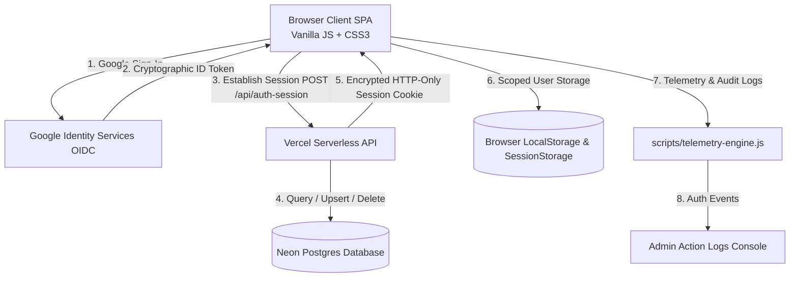
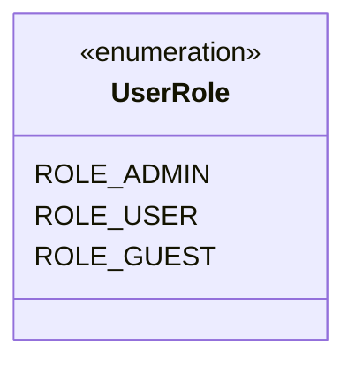
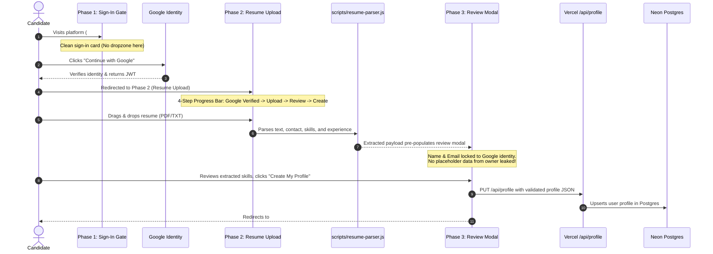
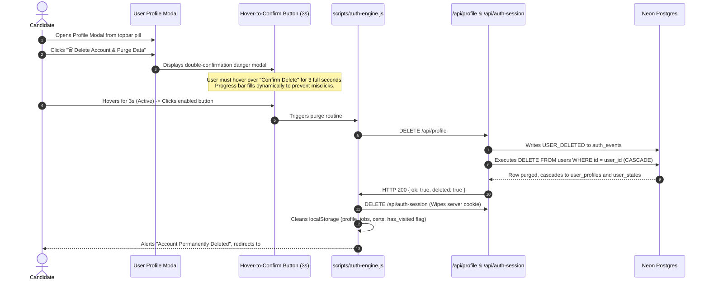

# Career Engine — Project Overview & Developer Guide

> **Platform:** Career Engine — Personal AI Career & Skill Intelligence Platform  
> **Repository:** `CipherPole/career-engine`  
> **Production URL:** `https://career-engine-five.vercel.app`  
> **Hosting & Edge:** Vercel Serverless Functions  
> **Primary Database:** Neon Postgres (`career_engine_prd` / `career_engine_dev`)  
> **Platform Owner & Admin:** Joseph Erexson III (`jerexson3@gmail.com`)  
> **Audience:** Future AI Agents, Engineering Contributors, and System Maintainers  
> **Last Updated:** September 2026

---

## 1. Executive Summary & Purpose

Career Engine is a high-performance, client-first career intelligence platform designed to help engineers and professionals analyze, track, and accelerate their careers. Originally created as a personal portfolio and career cockpit for Joseph Erexson III, the platform has evolved into a **universal multi-tenant platform** that provides every visitor with their own completely private, isolated workspace.

### Core Value Propositions
1. **Zero-Friction Drag-and-Drop Onboarding:** Candidates authenticate with Google and immediately upload their existing resume (PDF, TXT, DOCX) to auto-extract their profile without manually filling tedious forms.
2. **Strict Multi-Tenant Isolation (Zero Data Leakage):** Every new user begins with a clean slate. New users never see or inherit personal data, work history, or compensation figures from the platform owner.
3. **ATS Resume Studio & Skills Intelligence:** Real-time keyword scanning, ATS readiness scoring (0–100), and interactive radar charts mapping skills to target market requirements.
4. **Comprehensive Job Search CRM:** Full application pipeline (Wishlist, Applied, Interviewing, Offer, Rejected) with persistent synchronization.
5. **Continuous Learning & Certification Hub:** Curriculum pathways, hands-on lab projects, and credential tracking.
6. **Zero-Trust Security & Self-Service Account Purge:** Hardened Google OIDC session management, serverless token validation, and a protective **hover-to-confirm account deletion** feature that completely wipes all cloud and browser data.

---

## 2. Platform Architecture & Technology Stack

Career Engine follows an elegant **Modern Vanilla Web Architecture** prioritizing extreme speed, zero bundle bloat, zero runtime dependencies, and high security.



### Technology Matrix

| Layer | Technology | Rationale |
| :--- | :--- | :--- |
| **Frontend Framework** | Pure Vanilla JavaScript (ES2022+ Modules) | Zero build step needed, instantaneous local boot, maximum longevity. |
| **Styling & Design System** | Custom Vanilla CSS (Design Tokens, Glassmorphism, Aurora Gradients) | Tailored dark theme, sub-millisecond layout passes, zero external CSS dependencies. |
| **Hosting & CDN** | Vercel Edge Network | Sub-50ms TTFB worldwide, automatic branch preview deployments. |
| **Serverless Backend** | Node.js Serverless Functions (`/api/*.js`) | Lightweight micro-endpoints running on AWS Lambda via Vercel. |
| **Relational Database** | Neon Postgres (Serverless PostgreSQL) | Instant branchable database with connection pooling and JSONB support. |
| **Authentication** | Google Identity Services (GIS) + OIDC JWT + Sealed Cookies | Enterprise zero-credential client hygiene; no passwords stored on platform. |
| **Client-Side Parsing** | Regex & Stream Tokenizer (`scripts/resume-parser.js`) | Instant client-side PDF/TXT parsing with zero server upload needed for extraction. |

---

## 3. User Personas & Role-Based Access Control (RBAC)

The platform operates under three strict identity roles:



### 1. `ROLE_ADMIN` (Platform Owner)
- **Identity:** Strictly reserved for `jerexson3@gmail.com`.
- **Privileges:**
  - Full access to all platform views and features.
  - Access to the **Administrator Console (`#settings`)**.
  - Real-time **Admin Action Logs** inspecting all user registrations, logins, and deletions.
  - Telemetry diagnostics, error interception, and dynamic trace routes.
  - Immunity from self-deletion (owner account cannot be purged via API).

### 2. `ROLE_USER` (Authenticated Candidate)
- **Identity:** Any user who signs in using a valid Google account.
- **Privileges:**
  - Isolated private profile (`user_profiles` table + `careerEngine_profile_<email>`).
  - Isolated job tracker state (`careerEngine_jobs_<email>`).
  - Isolated training and certifications state (`careerEngine_training_<email>`).
  - Access to Resume Studio, Skills Radar, and Job Search CRM.
  - Self-service **Account Deletion** with complete data purge.
  - Restricted from accessing `#settings` (Admin Console).

### 3. `ROLE_GUEST` (Unauthenticated Visitor)
- **Identity:** Any visitor who has not signed in.
- **Privileges:**
  - Access to the **Sign-In Gate (`#signin`)**.
  - Access to legal documents: **Terms of Service (`#terms`)** and **User Agreement (`#agreement`)**.
  - Route guards prevent unauthorized access to candidate workspaces.

---

## 4. End-to-End User Lifecycles

### 4.1 New User Onboarding Flow (4 Steps)

To maximize conversion and eliminate cold-start drop-off, the onboarding process is streamlined into four intuitive steps:



1. **Step 1: Sign-In Gate (`#signin` - Phase 1):**  
   A distraction-free, motion-aurora landing page with a single prominent Google button. No complex forms or confusing dropzones on the entry door.
2. **Step 2: Dedicated Resume Upload (`#signin` - Phase 2):**  
   Shown immediately after Google authentication for new users. Renders a step progress bar:
   `[✓ Google Verified] ──▶ [📄 Upload Resume (Active)] ──▶ [👁️ Review] ──▶ [🚀 Create Profile]`  
   Features a large interactive dropzone, file selector, and manual paste fallback.
3. **Step 3: Interactive Review Modal (`scripts/onboarding-wizard.js`):**  
   Presents the candidate with the extracted summary, target role, technical skills, and experience.  
   - Email is pre-filled from the verified Google session and rendered readonly with a `[✅ Google Verified]` badge.
   - Experience, education, and accomplishments default to empty arrays (`[]`) if not present on the resume, ensuring zero personal data from Joseph is leaked.
4. **Step 4: Profile Activation:**  
   The candidate clicks **"Create My Profile"**, which saves the profile to Neon Postgres (`/api/profile`) and browser cache, activating their private dashboard.

---

### 4.2 Account Deletion & Complete Purge Flow

Career Engine respects user privacy and compliance (GDPR/CCPA) through an ironclad account deletion feature:



#### Key Guarantees:
- **Accidental Click Prevention:** The confirmation button requires a continuous **3-second hover** to charge up its progress bar before becoming clickable. If the user moves their mouse away, the timer resets immediately.
- **Server-Side Cascading Delete:** Neon Postgres uses `ON DELETE CASCADE` on `user_profiles` and `user_states`. Deleting the user row instantly and completely removes all profile and state data.
- **Audit Traceability:** Before deleting the user row, the server logs a `USER_DELETED` event into `auth_events` with `user_id` set to `NULL` (`ON DELETE SET NULL`), preserving security audit logs for the platform administrator.
- **Clean Re-Registration:** The client wipes `careerEngine_has_visited`, ensuring that if the user signs in again later with Google, they are correctly recognized as a new candidate and guided through Phase 2 resume upload.

---

## 5. Multi-Tenant Data Isolation Model

To guarantee privacy, the platform isolates data at both the client and server tiers:

```
┌────────────────────────────────────────────────────────────────────────┐
│                        BROWSER LOCAL STORAGE                           │
├───────────────────────────────────┬────────────────────────────────────┤
│ User A (e.g. samantha@gmail.com)  │ User B / Admin (jerexson3@gmail.com│
├───────────────────────────────────┼────────────────────────────────────┤
│ careerEngine_profile_samantha...  │ careerEngine_profile_jerexson3...  │
│ careerEngine_jobs_samantha...     │ careerEngine_jobs_jerexson3...     │
│ careerEngine_training_samantha... │ careerEngine_training_jerexson3... │
│ careerEngine_certs_samantha...    │ careerEngine_certs_jerexson3...    │
└───────────────────────────────────┴────────────────────────────────────┘

┌────────────────────────────────────────────────────────────────────────┐
│                         NEON POSTGRES DATABASE                         │
├────────────────────────────────────────────────────────────────────────┤
│ users: [ id: 1, email: 'jerexson3...', role: 'admin' ]                 │
│ users: [ id: 2, email: 'samantha...', role: 'user' ]                   │
│                                                                        │
│ user_profiles: [ user_id: 1, profile_json: { ...Joseph's data... } ]   │
│ user_profiles: [ user_id: 2, profile_json: { ...Samantha's data... } ] │
└────────────────────────────────────────────────────────────────────────┘
```

1. **Client-Side Key Scoping:** All state keys are dynamically prefixed with the user's normalized email address (e.g., `careerEngine_profile_${normalizedEmail}`).
2. **Database Row Scoping:** Server endpoints (`/api/profile`, `/api/state`) enforce session authentication via encrypted HTTP-only cookies (`career_engine_session`). The server reads `session.uid`, queries the database for that specific user ID, and never allows cross-user data access.

---

## 6. Admin Action Logs & Telemetry Engine

The platform includes an enterprise-grade telemetry and observability subsystem:

- **Client Ring Buffer (`scripts/telemetry-engine.js`):** Captures the last 150 events across categories (`AUTH`, `NETWORK`, `ROUTER`, `RBAC`, `SYSTEM`).
- **Server Auth Events Table (`auth_events`):** Tracks critical platform identity actions:
  - `USER_CREATED`: Logged when a new user registers (Purple badge).
  - `USER_SIGNIN`: Logged on every successful login (Blue badge).
  - `USER_SIGNOUT`: Logged on sign-out (Gray badge).
  - `USER_DELETED`: Logged upon self-service account deletion (Red badge).
- **Admin Console (`#settings`):** The platform owner has access to a live, auto-refreshing (every 10 seconds) Action Log table with a manual `🔄 Refresh Now` button and one-click diagnostic report export.

---

## 7. Developer Quickstart & Common Tasks

### 7.1 Running Locally
```powershell
# Method 1: Double-click launch.bat or open index.html directly in Chrome/Edge
.\launch.bat

# Method 2: Run a local static server
npx serve -l 4444 .
```

### 7.2 Running Required Checks Before Commit
In accordance with `AGENTS.md`, always run:
```powershell
# 1. Run security & policy scan
npm test

# 2. Run dependency vulnerability audit
npm audit
```

### 7.3 Managing Database Schema
Schema auto-migration runs automatically on the first database call in `api/_lib/db.js` via `ensureSchema()`. Tables created:
- `users`: Core identity table (Google sub, email, name, role).
- `user_profiles`: JSONB store for structured resume profiles.
- `user_states`: Key-value JSONB store for application and training states.
- `auth_events`: Chronological security event ledger.
